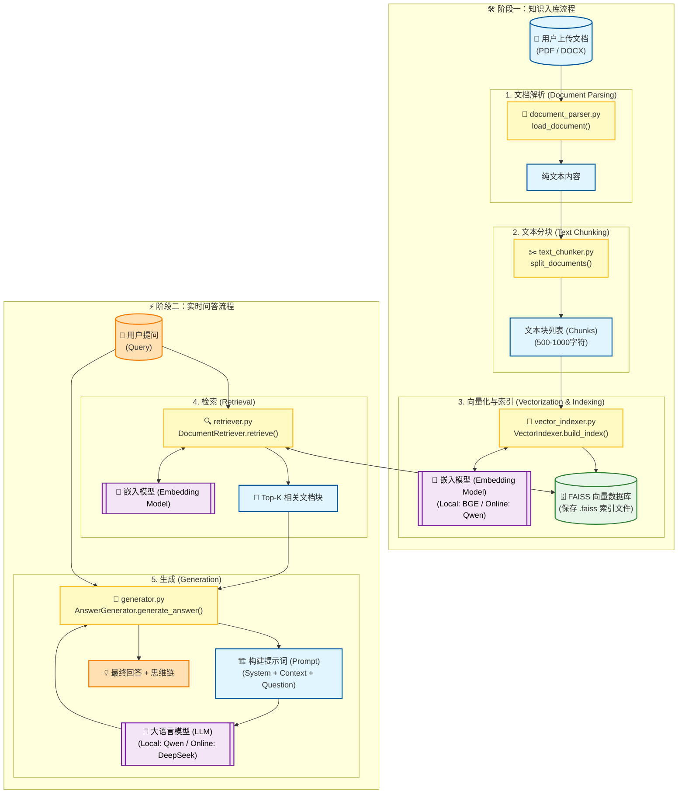

# 🏢 企业规章制度原生RAG问答系统

基于检索增强生成技术的智能文档问答平台，专为企业规章制度查询优化设计。

## ✨ 系统特性

- 🔄 **双模式运行**: 支持本地Ollama与在线SiliconFlow两种部署方式
- 📄 **智能文档解析**: 完整支持PDF、DOCX格式文档解析
- 🔍 **语义检索**: 基于FAISS的高效相似度搜索
- 🧠 **思维链展示**: 实时显示AI推理过程，提升答案可信度
- 📊 **实时可视化**: 分块处理、向量化全程可视
- ⚙️ **透明配置**: 右上角显示核心配置参数
- 🎨 **现代界面**: 简洁美观的Gradio Web界面

## 🏗️ 系统架构

### 📊 系统架构图



###  代码阅读指南 (核心逻辑解析)

以下顺序对应数据在系统中的流转过程。您可以对照代码文件，按步骤了解 RAG 系统是如何从零构建的。

#### 1. 第一步：统一格式 (文档解析)
- 📄 **`rag_system/document_parser.py`**
- **核心职能**：将不同格式的源文件（PDF、Word）转换为系统可处理的标准纯文本。
- **阅读重点**：关注 `load_document` 函数。这里还包含了一个**关键的预处理逻辑**：如果是 `.docx` 文档，系统会优先尝试用正则表达式按“一级标题”（例如“第一章”）进行粗粒度的语义分割。如果是 `.pdf` 文档，则会基于章节关键词进行智能切分。这样做是为了确保一个完整的章节尽量不被打散。

#### 2. 第二步：控制粒度 (文本分块)
- 📄 **`rag_system/text_chunker.py`**
- **核心职能**：将长文档细化为适合模型处理的短片段。
- **阅读重点**：这里使用了 LangChain 的 `RecursiveCharacterTextSplitter`。
  - **问**：为什么最终分块大小不全是 600 字？
  - **答**：因为这是一种**混合分块策略**。
    1. 首先，它会优先寻找自然的“分割符”（如换行符 `\n\n`、句号 `。`），在这些位置切分，以保持句子的完整性。
    2. 只有当一段话在自然分割后依然超过 `CHUNK_SIZE` (600字) 时，它才会强制按字符长度截断。
    3. 所以，大多数分块会略小于 600 字，这是为了优先保证“一句话说完”。

#### 3. 第三步：数据向量化 (向量索引)
- 📄 **`rag_system/vector_indexer.py`**
- **核心职能**：将文本转化为计算机可计算的数学向量，并建立索引库。
- **阅读重点**：关注 `VectorIndexer` 类。它加载嵌入模型，将文本块转换成高维向量。这一步决定了系统“理解”文本相似度的能力。

#### 4. 第四步：精准召回 (检索器)
- 📄 **`rag_system/retriever.py`**
- **核心职能**：在海量数据中快速找到与用户问题最相关的片段。
- **检索策略**：目前使用的是纯向量检索（Dense Retrieval），尚未引入关键词混合检索。
- **阅读重点**：关注 `retrieve` 方法。它计算用户问题向量与知识库向量的余弦相似度。
  - **阈值机制**：系统设定了 `DEFAULT_RETRIEVAL_THRESHOLD` (0.4)。如果最相似的片段得分都低于这个值，系统会判定“未找到相关信息”，防止强行回答。

#### 5. 第五步：上下文生成 (生成器)
- 📄 **`rag_system/generator.py`**
- **核心职能**：结合检索到的知识，由大模型生成最终回答。
- **阅读重点**：关注 Prompt 的构建。代码会将检索到的 Top-K 片段拼接，强制大模型“基于以下背景信息”回答，这是防止幻觉的关键。

#### 6. 第六步：交互呈现 (Web界面)
- 📄 **`rag_system/gradio_interface.py`**
- **核心职能**：串联后端模块，提供可视化界面。

### 核心组件与技术栈

- **前端**: Gradio Web界面
- **文档处理**: PyPDF2, python-docx
- **向量检索**: FAISS, BGE嵌入模型
- **大语言模型**: 
  - 本地: Ollama (qwen3:4b)
  - 在线: SiliconFlow (DeepSeek-V3.2)
- **嵌入模型**:
  - 本地: BAAI/bge-small-zh-v1.5
  - 在线: Qwen/Qwen3-Embedding-8B

---

## 🚀 快速开始

### 1. 环境准备
- Python 3.8+
- Ollama服务（本地模式）
- SiliconFlow API Key（在线模式）

### 2. 安装步骤
```bash
# 创建虚拟环境
py -m venv venv
source venv/bin/activate  # Linux/Mac
# 或 venv\Scripts\activate  # Windows

# 安装依赖
pip install -r requirements.txt -i https://pypi.tuna.tsinghua.edu.cn/simple
```
> **注意**：`requirements.txt` 中已锁定了 `langchain`、`numpy`、`gradio` 等核心库的版本，以避免兼容性问题。

### 3. 系统配置 (可选)
所有核心参数均可在 `rag_system/config.py` 中集中修改，无需改动业务代码。

**调整分块策略** (如果发现回答经常断章取义)：
```python
CHUNK_SIZE = 600                   # 目标块大小
CHUNK_OVERLAP = 120                 # 重叠大小
MAX_CHUNK_SIZE_BEFORE_SPLIT = 800  # 预分块最大阈值
```

**调整检索敏感度** (如果觉得回复内容太发散或检索不到内容)：
```python
DEFAULT_RETRIEVAL_K = 10            # 检索数量
DEFAULT_RETRIEVAL_THRESHOLD = 0.4  # 相似度阈值
```

### 4. 启动系统
```bash
python main.py
```
访问：http://localhost:7860

---

## 🎯 演示使用指南

### 基本操作流程
1. **选择模式**: 推荐使用 Online 模式（DeepSeek-R1）体验更好的推理能力。
2. **上传文档**: 上传项目附带的 `员工手册.docx` 和 `差旅报销细则.pdf`。
3. **观察处理**: 留意右侧的“文档分块”展示，解释分块大小不一的原因。
4. **开始提问**: 使用下方精心设计的测试问题。

### 🧪 测试问题深度解析 (Demo必看)

这两个问题用来验证系统处理**复杂逻辑**和**跨文档推理**的能力。

#### 问题 1：条件判断与多分支查询
**Q: `部门主管可以选择什么舱位的机票？一天餐费是多少钱？`**

- **设计陷阱**：
  1. **机票**：不是简单的“经济舱”，规章里有一个“连续飞行5小时”的特殊条件。
  2. **餐费**：没有固定金额，取决于“城市等级”这一变量。
- **预期标准回答**：
  > 机票一般预订经济舱，但连续飞行超过5小时可预订公务舱；餐费根据城市等级分别为150元、120元或100元。

#### 问题 2：跨文档多跳推理 (Multi-hop Reasoning)
**Q: `M3级别员工去上海出差住宿标准`**

- **设计陷阱**：这也是最难的一个问题。
  1. **第一跳**：AI 必须先去《员工手册》查到 `M3 = 部门总监`。
  2. **第二跳**：AI 必须知道 `上海 = 一线城市`。
  3. **第三跳**：去《差旅细则》表格找到“部门总监”+“一线城市”的交叉点。
- **预期标准回答**：
  > **1000元/晚**。思维链应包含：识别出M3为部门总监 -> 识别出上海为一线城市 -> 查表得出1000元。

---

## 🔧 故障排除

1. **端口冲突**: 启动脚本已包含自动清理端口功能。
2. **模块缺失**: 请确保使用 `pip install -r requirements.txt` 安装了完整依赖。
3. **API错误**: 检查 `config.py` 或环境变量中的 `SILICONFLOW_API_KEY`。

---

## 💡 工程经验总结与扩展

本项目展示了一个**最小可行性(MVP)的原生 RAG 系统**，核心在于“透明化”和“可控性”。

**我们实现了什么？**
- ✅ **全链路透明**：从分块到向量再到检索，每一步都看得见。
- ✅ **混合处理策略**：针对结构化文档的预处理与通用分块相结合。
- ✅ **工程化封装**：配置分离、端口管理、环境隔离。

**未来可以做哪些扩展？**
1. **混合检索 (Hybrid Search)**：目前仅使用了向量检索。可以引入 BM25 关键词检索，解决专有名词（如特定的项目代号）搜索不准的问题。
2. **多模态解析**: 引入 OCR 技术，像mineru2.5、paddocr vlm等工具解析扫描件 PDF 或图片中的表格数据。
3. **重排序 (Re-ranking)**: 在检索回 Top-50 后，接一个精排模型（如 BGE-Reranker），从中选出质量最高的 Top-5，能够显著提升回答准确率。
